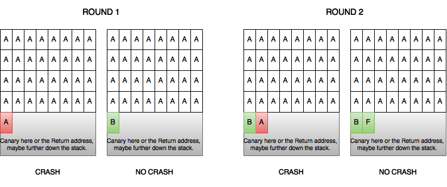

# Blind ROP

## Stack Reading

The fundamental principle of stack-reading involves writing individual bytes to the end of a buffer, assuming nothing is appended to the input via i.e. read.  If any values are appended to the end of a payload, then this attack is no longer viable as more than the intended bytes will be overwritten:



Source: [NCC Group - Blind Return Oriented Programming](https://www.nccgroup.trust/uk/about-us/newsroom-and-events/blogs/2015/june/blind-return-oriented-programming/)

I usually use the following code to perform a stack-reading attack:

```python
def stack_read(payload, run):  
    if run > 8: 
        return payload[-8:] 
    for i in range(0, 256): 
        x = chr(i) 
        topush = payload + x 
        res = exploit(topush) 
        if res == None: 
            continue 
        else: 
            print repr(x) 
            return stack_read(topush, run+1) 
```

Things to consider are that it is not generic, is designed for 64-bit systems and assumes that the function exploit will return a `None` type in the event of failure.  Consequently, the failure condition must be known, and must exist outside the overflown stack frame.

What's interesting about this method is that it can also be used to achieve a stack address leak in the event of ASLR and a binary address leak in the event of PIE.

### Leak Binary/Stack Address

Since RBP/EBP directly follows the canary, once we hit this we can perform the same stack reading but on the RBP/EBP value.  This of course assumes that our failure/success state is predicated on a corrupted stack, as it would have to exist in a seperate stack frame to our current.  The RBP will be at a constant offset to the stack start in most cases and therefore can be used to predict the current location of the stack.

The same follows but for RIP/EIP.  This can be more difficult as there can be many addresses which won't outright crash the program, but assuming the same success/failure state is quite simple.  Further, the last byte is not subject to ASLR/PIE so this means only 7 bytes need to be calculated.

{% embed data="{\"url\":\"http://www.scs.stanford.edu/~sorbo/brop/bittau-brop.pdf\",\"type\":\"rich\",\"embed\":{\"type\":\"reader\",\"url\":\"https://docs.google.com/viewer?embedded=true&url=http%3A%2F%2Fwww.scs.stanford.edu%2F~sorbo%2Fbrop%2Fbittau-brop.pdf\",\"html\":\"<div style=\\"left: 0; width: 100%; height: 0; position: relative; padding-bottom: 141.4227%;\\"><iframe src=\\"https://docs.google.com/viewer?embedded=true&amp;url=http%3A%2F%2Fwww.scs.stanford.edu%2F~sorbo%2Fbrop%2Fbittau-brop.pdf\\" style=\\"border: 0; top: 0; left: 0; width: 100%; height: 100%; position: absolute;\\" allowfullscreen></iframe></div>\",\"aspectRatio\":0.7071}}" %}



[https://www.nccgroup.trust/uk/about-us/newsroom-and-events/blogs/2015/june/blind-return-oriented-programming/](https://www.nccgroup.trust/uk/about-us/newsroom-and-events/blogs/2015/june/blind-return-oriented-programming/)

